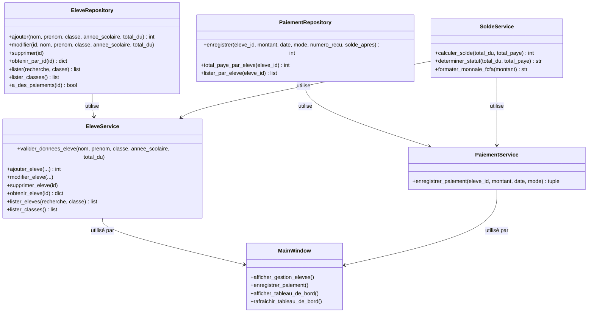

# Documentation Technique - EduPaie

## Table des matières

1. [Architecture en couches](#architecture-en-couches)
2. [Modélisation de la base de données](#modélisation-de-la-base-de-données)
3. [Choix techniques](#choix-techniques)
4. [Limites connues](#limites-connues)
5. [Captures d'écran](#captures-décran)

---

## Architecture en couches

EduPaie respecte une architecture en trois couches strictement séparées pour garantir la maintenabilité et la testabilité du code.

### Schéma d'architecture

```
┌─────────────────────────────────────────────────────────────┐
│                     Couche Interface (ui/)                  │
│  ┌──────────────┐  ┌──────────────┐  ┌──────────────┐      │
│  │ MainWindow   │  │ ElevesWidget │  │ PaiementDialog│     │
│  └──────────────┘  └──────────────┘  └──────────────┘      │
│  - Gère les interactions utilisateur                       │
│  - Affiche les données                                     │
│  - Gère les erreurs avec QMessageBox                       │
│  - N'exécute JAMAIS de SQL directement                    │
└──────────────────────┬──────────────────────────────────────┘
                       │ Appels
                       ▼
┌─────────────────────────────────────────────────────────────┐
│                  Couche Logique Métier (services/)          │
│  ┌──────────────┐  ┌──────────────┐  ┌──────────────┐      │
│  │EleveService  │  │SoldeService  │  │PaiementService│     │
│  └──────────────┘  └──────────────┘  └──────────────┘      │
│  - Valide les données                                     │
│  - Applique les règles métier                              │
│  - Convertit les erreurs de base en erreurs métier        │
│  - Fonctions pures pour les calculs                        │
└──────────────────────┬──────────────────────────────────────┘
                       │ Appels
                       ▼
┌─────────────────────────────────────────────────────────────┐
│            Couche Accès aux Données (repositories/)          │
│  ┌──────────────┐  ┌──────────────┐                         │
│  │EleveRepository│ │PaiementRepository│                       │
│  └──────────────┘  └──────────────┘                         │
│  - Encapsule tout le code SQL                               │
│  - Requêtes paramétrées (sécurité)                          │
│  - Aucune logique métier                                    │
└──────────────────────┬──────────────────────────────────────┘
                       │ SQL
                       ▼
┌─────────────────────────────────────────────────────────────┐
│                  Base de données SQLite                      │
│  Tables : eleve, paiement, sequence_recus                    │
└─────────────────────────────────────────────────────────────┘
```

### Responsabilités de chaque couche

#### Couche Interface (`ui/`)
- **Responsabilité** : Gérer les interactions avec l'utilisateur
- **Règles** :
  - N'importe jamais `sqlite3`
  - N'exécute jamais de requête SQL
  - Appelle uniquement les services
  - Affiche les erreurs avec `QMessageBox`
- **Composants** :
  - `MainWindow` : Fenêtre principale avec menu
  - `ElevesWidget` : Liste des élèves avec filtres
  - `EleveFormDialog` : Formulaire d'ajout/modification
  - `PaiementDialog` : Formulaire d'enregistrement de paiement
  - `FicheEleveDialog` : Fiche détaillée avec historique
  - `DashboardWidget` : Tableau de bord avec indicateurs

#### Couche Logique Métier (`services/`)
- **Responsabilité** : Contenir les règles métier et validations
- **Règles** :
  - Valide les données avant persistance
  - Convertit les erreurs de base en erreurs métier
  - Utilise des fonctions pures pour les calculs
  - Orchestre les appels aux repositories
- **Composants** :
  - `EleveService` : Gestion des élèves (validation, conversion d'erreurs)
  - `SoldeService` : Calcul du solde et détermination du statut (fonctions pures)
  - `PaiementService` : Enregistrement des paiements (transaction atomique)
  - `RecuService` : Construction des données de reçus
  - `RecuPDF` : Génération des PDF
  - `FicheEleveService` : Agrégation des données de la fiche
  - `DashboardService` : Calcul des indicateurs globaux

#### Couche Accès aux Données (`repositories/`)
- **Responsabilité** : Encapsuler tout l'accès aux données
- **Règles** :
  - Tout le code SQL est ici
  - Requêtes paramétrées avec `?` (jamais de f-string dans le SQL)
  - Aucune logique métier
  - Gère les connexions à la base
- **Composants** :
  - `EleveRepository` : CRUD pour les élèves
  - `PaiementRepository` : CRUD pour les paiements

---

## Modélisation de la base de données

### MCD (Modèle Conceptuel de Données)

```mermaid
erDiagram
    ELEVE ||--o{ PAIEMENT : effectue
    SEQUENCE_RECUS ||--|| PAIEMENT : genere

    ELEVE {
        int id PK
        string nom
        string prenom
        string classe
        string annee_scolaire
        int total_du CHECK ">= 0"
        date date_creation
    }

    PAIEMENT {
        int id PK
        int eleve_id FK
        float montant CHECK "> 0"
        date date
        string mode CHECK "IN ('espèces', 'chèque', 'virement', 'mobile money')"
        string numero_recu UNIQUE NOT NULL
        int solde_apres
    }

    SEQUENCE_RECUS {
        int annee PK
        int derniere_valeur
    }
```

### UML (Diagramme de classes simplifié)



### Choix de modélisation

#### 1. Solde calculé vs stocké
**Choix** : Le solde est calculé dynamiquement à partir de `total_du` et de la somme des paiements.

**Justification** :
- Évite les incohérences (solde ne peut pas être incorrect)
- Permet de modifier le `total_du` sans recalculer tous les soldes
- Garantit l'intégrité des données
- Plus simple à maintenir

**Exception** : `solde_apres` est stocké dans la table `paiement` pour garantir la réimpression identique des reçus.

#### 2. Numérotation des reçus
**Choix** : Utilisation d'une table de séquence `sequence_recus` avec année.

**Justification** :
- Garantit l'unicité des numéros (contrainte UNIQUE en base)
- Permet de recommencer la numérotation chaque année scolaire
- Transaction atomique évite les doublons en cas de concurrence
- Format lisible : REC-2026-00001

#### 3. Clés étrangères et contraintes
**Choix** : `ON DELETE RESTRICT` sur la clé étrangère `paiement.eleve_id`.

**Justification** :
- Empêche la suppression d'un élève ayant des paiements
- Préserve l'historique des reçus (obligatoire pour traçabilité)
- Force l'utilisateur à supprimer les paiements avant l'élève (non implémenté pour sécurité)

#### 4. Immuntabilité des paiements
**Choix** : Les paiements ne peuvent être ni modifiés ni supprimés.

**Justification** :
- Les reçus sont des documents légaux
- Chaque numéro de reçu doit correspondre exactement à un paiement
- Toute modification nécessiterait une annulation et un nouveau paiement
- Simplifie l'audit et la traçabilité

---

## Choix techniques

### 1. Python 3.10+
**Choix** : Utilisation de Python 3.10 ou supérieur.

**Justification** :
- Syntaxe moderne (match/case non utilisé mais disponible)
- Meilleure gestion des types
- Compatibilité avec PySide6
- Support à long terme de Python

### 2. PySide6
**Choix** : Utilisation de PySide6 pour l'interface graphique.

**Justification** :
- Bibliothèque officielle Qt pour Python
- Documentation complète
- Communauté active
- Widgets riches et personnalisables
- Compatibilité multi-plateforme (Windows, macOS, Linux)

### 3. SQLite
**Choix** : Utilisation de SQLite comme base de données.

**Justification** :
- Aucune installation de serveur requise
- Base de données dans un seul fichier
- Idéal pour les applications desktop
- Suffisant pour le volume de données (quelques centaines d'élèves)
- Support des transactions et des clés étrangères

### 4. Pas d'ORM
**Choix** : Utilisation directe de `sqlite3` sans ORM.

**Justification** :
- Contrôle total sur les requêtes SQL
- Meilleure compréhension de la base de données
- Évite la complexité des ORM pour un projet simple
- Requêtes optimisées manuellement
- Pas de dépendance supplémentaire

### 5. fpdf2
**Choix** : Utilisation de fpdf2 pour la génération de PDF.

**Justification** :
- Bibliothèque légère et simple
- Suffisante pour des reçus simples
- Compatible avec Python 3
- Support des polices standard (latin-1)

**Limitation** : Les polices standard ne supportent que le latin-1. Pour supporter l'UTF-8, il faudrait embarquer une police TTF, ce qui augmenterait la taille de l'exécutable.

### 6. Transactions atomiques
**Choix** : Utilisation de `BEGIN IMMEDIATE` pour l'enregistrement des paiements.

**Justification** :
- Garantit l'atomicité de l'opération
- Empêche les doublons de numéros de reçu en cas de concurrence
- Rollback automatique en cas d'erreur
- Cohérence de la base de données garantie

### 7. Montants en francs CFA
**Choix** : Stockage des montants en francs CFA (entiers).

**Justification** :
- Évite les erreurs d'arrondi des nombres flottants
- Calculs exacts avec des entiers
- Devise adaptée au contexte d'utilisation
- Formatage avec séparateur de milliers pour l'affichage

### 8. Gestion globale des exceptions
**Choix** : Utilisation de `sys.excepthook` pour capturer toutes les exceptions.

**Justification** :
- L'application ne plante jamais
- Affiche un message clair à l'utilisateur
- Écrit les erreurs dans un fichier de log
- Permet le diagnostic des problèmes

### 9. PyInstaller --onefile
**Choix** : Utilisation de PyInstaller avec l'option `--onefile`.

**Justification** :
- Exécutable unique facile à distribuer
- Pas besoin d'installer Python sur la machine cible
- Dossier temporaire en lecture seule géré par `resource_utils`
- Copie automatique de la base initiale au premier lancement

---

## Limites connues

### 1. Mono-utilisateur
**Limite** : L'application est conçue pour un seul utilisateur simultané.

**Conséquence** : Pas de gestion des accès multi-utilisateurs, pas de droits d'accès.

### 2. Pas de sauvegarde automatique
**Limite** : Aucune sauvegarde automatique des données.

**Conséquence** : L'utilisateur doit sauvegarder manuellement le dossier `data/`.

### 3. Pas d'export/import
**Limite** : Pas de fonctionnalité d'export ou d'import de données.

**Conséquence** : Difficile de migrer les données vers un autre système.

### 4. Polices PDF limitées
**Limite** : Les reçus PDF utilisent des polices standard (latin-1 uniquement).

**Conséquence** : Pas de support des caractères accentués spéciaux ou des caractères non latins.

### 5. Pas de statistiques avancées
**Limite** : Le tableau de bord montre des indicateurs simples, pas de graphiques.

**Conséquence** : Pas d'analyse visuelle des tendances de paiement.

### 6. Pas de gestion des absences
**Limite** : L'application ne gère que les paiements, pas les absences.

**Conséquence** : Pas de lien entre présence et paiement.

### 7. Pas de multi-établissement
**Limite** : L'application est conçue pour un seul établissement.

**Conséquence** : Impossible de gérer plusieurs écoles dans la même base.

---

## Captures d'écran

### Écran principal - Tableau de bord
[Capture d'écran : Tableau de bord avec les 4 cartes d'indicateurs et la liste des élèves]

### Écran principal - Gestion des élèves
[Capture d'écran : Liste des élèves avec barre de recherche, filtre classe et boutons d'action]

### Dialogue - Ajout/Modification d'élève
[Capture d'écran : Formulaire avec champs nom, prénom, classe, année scolaire, total dû]

### Dialogue - Enregistrement de paiement
[Capture d'écran : Formulaire avec élève affiché, solde restant, montant, date, mode]

### Dialogue - Fiche élève
[Capture d'écran : Fiche détaillée avec identité, statistiques et tableau des paiements]

### Reçu PDF
[Capture d'écran : Reçu PDF généré avec toutes les informations de paiement]

---

## Conclusion

EduPaie est une application robuste et bien structurée qui respecte les bonnes pratiques de développement logiciel. L'architecture en couches garantit la maintenabilité, la gestion des erreurs assure la stabilité, et l'interface utilisateur est adaptée aux utilisateurs non techniques. Les choix techniques ont été justifiés pour garantir la fiabilité, la simplicité et la performance de l'application.
