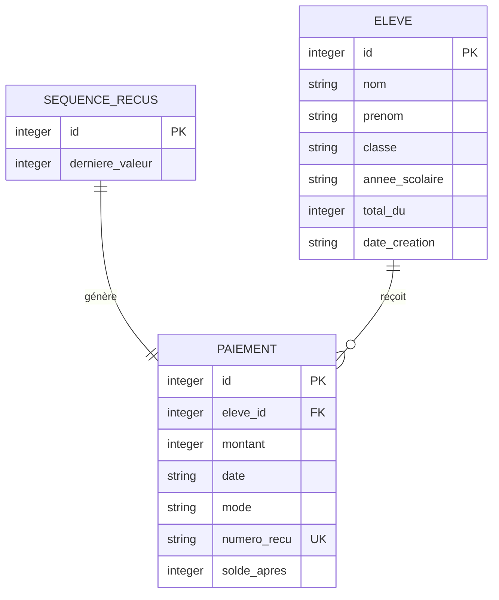

# Schéma de la base de données EduPaie

## Diagramme MCD/UML (Mermaid)



## Explication des choix de modélisation

### 1. Table `eleve`

**Champs :**
- `id` : Clé primaire auto-incrémentée pour identifier chaque élève de manière unique
- `nom`, `prenom` : Informations d'identification obligatoires (NOT NULL)
- `classe` : Niveau scolaire de l'élève (ex: 6ème A, 5ème B)
- `annee_scolaire` : Année scolaire concernée (ex: 2025-2026)
- `total_du` : Montant total dû par l'élève pour l'année scolaire (en francs CFA)
  - Contrainte CHECK (total_du >= 0) pour empêcher les montants négatifs
- `date_creation` : Date de création de la fiche élève (automatique)

**Justification :**
- Séparation nom/prénom pour faciliter les tris et recherches
- Champ `annee_scolaire` permet de gérer plusieurs années dans la même base
- `total_du` stocké car c'est une donnée de référence (montant des frais scolaires)
- Les contraintes NOT NULL garantissent l'intégrité des données

### 2. Table `paiement`

**Champs :**
- `id` : Clé primaire auto-incrémentée
- `eleve_id` : Clé étrangère vers la table `eleve`
  - Contrainte ON DELETE CASCADE : suppression d'un élève supprime ses paiements
- `montant` : Montant du paiement (en francs CFA)
  - Contrainte CHECK (montant > 0) pour empêcher les montants nuls ou négatifs
- `date` : Date du paiement (automatique par défaut)
- `mode` : Mode de paiement
  - Contrainte CHECK pour limiter aux valeurs autorisées : espèces, chèque, virement, mobile money
- `numero_recu` : Numéro unique du reçu
  - Contrainte UNIQUE pour garantir l'unicité
  - Contrainte NOT NULL car chaque paiement doit avoir un numéro de reçu
- `solde_apres` : Solde restant après ce paiement (en francs CFA)
  - Instantané du solde au moment de l'enregistrement
  - Permet de réimprimer le reçu à l'identique même si le total_du change

**Justification :**
- Clé étrangère avec CASCADE pour maintenir la cohérence référentielle
- Contrainte CHECK sur `mode` pour éviter les erreurs de saisie
- `numero_recu` UNIQUE pour éviter les doublons et permettre la traçabilité
- `solde_apres` stocke l'instantané du solde après ce paiement
  - **Pourquoi stocker le solde ?** : Permet de réimprimer un reçu à l'identique même si le total_du de l'élève change plus tard
  - **Exemple** : Un élève paie 50 000 FCFA (solde restant 100 000 FCFA). Si l'école augmente le total_du à 250 000 FCFA plus tard, le reçu original doit toujours montrer "Solde restant : 100 000 FCFA" et non 150 000 FCFA
  - **Immuabilité** : Les paiements ne sont ni modifiables ni supprimables, donc cet instantané reste fidèle à l'historique

### 3. Table `sequence_recus`

**Champs :**
- `id` : Clé primaire (fixée à 1)
- `derniere_valeur` : Dernière valeur utilisée pour la numérotation des reçus

**Justification :**
- Table dédiée à la séquence de numérotation pour garantir l'unicité
- Permet de générer des numéros de reçus au format REC-YYYY-XXXXX
- Évite les problèmes de concurrence en cas d'accès multi-utilisateurs

### 4. Pourquoi le solde est calculé et non stocké ?

**Avantages du calcul dynamique :**
1. **Intégrité des données** : Le solde est toujours cohérent avec les paiements réels
2. **Pas de risque de désynchronisation** : Si un paiement est modifié/supprimé, le solde reste correct
3. **Historique conservé** : On peut voir l'évolution du solde dans le temps
4. **Simplification de la maintenance** : Un seul point de vérité (les paiements)
5. **Performance acceptable** : Pour une petite structure scolaire, le calcul est instantané

**Formule de calcul :**
```
solde = total_du - SUM(montant des paiements de l'élève)
```

### 5. Mécanisme de numérotation des reçus

**Format :** REC-YYYY-XXXXX (ex: REC-2026-00001)

**Fonctionnement :**
1. La table `sequence_recus` stocke la dernière valeur utilisée
2. Lors de la création d'un paiement :
   - Lecture de la dernière valeur (ex: 0)
   - Incrémentation (ex: 1)
   - Mise à jour de la séquence
   - Génération du numéro avec padding de zéros (REC-2026-00001)
3. L'année est incluse pour permettre une nouvelle séquence chaque année scolaire

**Avantages :**
- Unicité garantie par la contrainte UNIQUE sur `numero_recu`
- Numéros lisibles et traçables
- Réinitialisation possible chaque année
- Pas de trous dans la séquence (tous les numéros sont utilisés)

### 6. Index créés

Pour optimiser les performances :
- `idx_paiement_eleve_id` : Recherche rapide des paiements d'un élève
- `idx_paiement_date` : Tri chronologique des paiements
- `idx_eleve_classe` : Recherche rapide des élèves par classe

### 7. PRAGMA foreign_keys = ON

Active les contraintes de clés étrangères dans SQLite pour garantir :
- Qu'on ne peut pas créer un paiement pour un élève inexistant
- Qu'on ne peut pas supprimer un élève sans supprimer ses paiements (ou passer en RESTRICT)

### 8. Trigger de validation des paiements

**Trigger :** `verifier_solde_paiement`

**Type :** BEFORE INSERT sur la table `paiement`

**Fonctionnement :**
- Avant chaque insertion de paiement, le trigger vérifie que le montant ne dépasse pas le solde restant
- Formule : `montant <= (total_du - SUM(montants existants))`
- Si le paiement dépasse le solde, le trigger lève une erreur ABORT
- L'erreur est capturée par `PaiementService` et affichée proprement à l'utilisateur via un QMessageBox

**Pourquoi un trigger ?**
- **Protection au niveau base de données** : Même si un script contourne la validation du service (ex: seed.py), la base refuse le paiement
- **Intégrité garantie** : Garantit qu'aucun paiement ne peut faire passer un solde sous 0
- **Double couche de protection** : PaiementService valide en Python, le trigger valide en SQL
- **Message d'erreur explicite** : L'utilisateur reçoit un message clair "Le paiement dépasse le solde restant"

**Exemple :**
- Élève avec `total_du = 120 000 FCFA` et déjà payé `85 000 FCFA`
- Solde restant : `35 000 FCFA`
- Tentative de paiement de `50 000 FCFA` → Refusé par le trigger
- Message d'erreur affiché : "Le paiement dépasse le solde restant"
